# BÁO CÁO PHÁT TRIỂN TOÀN DIỆN
## Dự Án Game Boss Fight 2D Platformer - C + Raylib
### Phiên bản hiện đại nhất: hệ Boom Node, cú lừa giả chết, đi ra cửa & hồi sinh (đối chiếu source thực tế)

> Tài liệu viết theo phong cách MD2FILE để dễ preview, export PDF/HTML/Markdown. Dùng Markdown, bảng, checklist, code block, Mermaid flowchart, có chèn screenshot.
>
> **Phiên bản này phản ánh CƠ CHẾ MỚI NHẤT trong source:** cốt lõi boss fight là **hệ Boom Node** (phá cục boom để qua phase), thêm chuỗi **cú lừa giả chết → đi ra cửa thoát → boss trồi lên → TRUE_ENRAGE**. Từ **Phase 2 trở đi boss BẬT LẠI kỹ năng tự động** (laser/slam/hazard/claw/barrage/rain) song song với boom. Gameplay tượng (statue) vẫn **vô hiệu hóa** (chỉ trang trí). Mọi số liệu lấy trực tiếp từ `boss/src/` và `src/main.c`.
>
> **Cập nhật mới nhất (bản fix 6 lỗi):** (1) camera shake làm mượt bằng sin theo thời gian (hết giật); (2) cửa thoát + trigger đồng bộ `doorX=1080`, `x>=1060`; (3) bật kỹ năng tự động boss từ Phase 2; (4) từ Phase 2 chỉ cục boom GIỮA bắn đạn đỏ, cục TRÁI = laser beam, cục PHẢI = shockwave pulse; (5) orb vàng có delay ngắn (4–7s) khi vào phase mới (không spawn tức thì); (6) standalone giữ HUD + update projectile/orb ở TRUE_ENRAGE.

---

## Quick Feature Overview

| Area | Nội dung |
| --- | --- |
| Cốt lõi gameplay | **Boom Node**: 3 cục boom mỗi phase, parry orb để phá, phá đủ 3 cục → qua phase |
| Twist kết trận | Giả chết → mở cửa thoát → player đi bộ ra → boss bất ngờ hồi sinh → TRUE_ENRAGE |
| Build output | `theforest.exe` (root Makefile, có `boss/src/boom.c`) |
| Diagrams | Mermaid cho game loop, boss state, boom node, fake-death cutscene, orb parry |
| Code | Fenced code blocks cho C, Python, Makefile, Bash |
| Images | Screenshot gameplay đặt trong `boss/assets/screenshots/` |
| Mục tiêu | Ghi lại cơ chế mới nhất + lý do thiết kế + lỗi đã gặp |

---

## Mục Lục

0. [Hướng Dẫn Ảnh Screenshot](#0-hướng-dẫn-ảnh-screenshot)
1. [Tóm Tắt Cập Nhật Mới Nhất](#1-tóm-tắt-cập-nhật-mới-nhất)
2. [Bối Cảnh Dự Án](#2-bối-cảnh-dự-án)
3. [Kiến Trúc Tổng Thể](#3-kiến-trúc-tổng-thể)
4. [Flowchart Tổng Quan](#4-flowchart-tổng-quan)
5. [Gameplay Loop](#5-gameplay-loop)
6. [Boss State Machine (8 trạng thái)](#6-boss-state-machine-8-trạng-thái)
7. [Hệ Boom Node (cốt lõi mới)](#7-hệ-boom-node-cốt-lõi-mới)
8. [Cơ Chế Orb Parry Phá Boom](#8-cơ-chế-orb-parry-phá-boom)
9. [Cú Lừa Giả Chết → Đi Ra Cửa → Hồi Sinh](#9-cú-lừa-giả-chết--đi-ra-cửa--hồi-sinh)
10. [TRUE_ENRAGE Và Kết Liễu Thật](#10-true_enrage-và-kết-liễu-thật)
11. [Animation Chết Của Boss (làm lại)](#11-animation-chết-của-boss-làm-lại)
12. [Hệ Thống Attack Tự Động (đã bật lại từ Phase 2)](#12-hệ-thống-attack-tự-động-của-boss-đã-bật-lại-từ-phase-2)
13. [Statue System (đã tắt gameplay)](#13-statue-system-đã-tắt-gameplay)
14. [Player, Đi-Bộ-Only Và Cheat](#14-player-đi-bộ-only-và-cheat)
15. [Camera Và Render](#15-camera-và-render)
16. [Âm Thanh Và UI HUD](#16-âm-thanh-và-ui-hud)
17. [Cấu Trúc Dữ Liệu](#17-cấu-trúc-dữ-liệu)
18. [Toàn Bộ Lỗi Đã Gặp](#18-toàn-bộ-lỗi-đã-gặp)
19. [Build, Rebuild Và Chạy Game](#19-build-rebuild-và-chạy-game)
20. [Đính Chính So Với Báo Cáo Cũ](#20-đính-chính-so-với-báo-cáo-cũ)
21. [Checklist Hoàn Thành](#21-checklist-hoàn-thành)
22. [Kết Luận](#22-kết-luận)

---

## 0. Hướng Dẫn Ảnh Screenshot

Báo cáo chèn sẵn link ảnh trỏ vào `boss/assets/screenshots/`. Chụp màn hình game, lưu đúng tên file bên dưới, ảnh sẽ tự hiển thị khi preview/export.

### 0.1. Tạo thư mục

```bash
cd boss
mkdir assets\screenshots      # Windows CMD
# hoặc: mkdir -p assets/screenshots
```

### 0.2. Danh sách ảnh nên chụp

| Tên file | Chụp lúc nào | Dùng ở mục |
| --- | --- | --- |
| `00_cover.png` | Ảnh đại diện đẹp nhất | Mục 0 |
| `pre_intro.png` | PRE_INTRO: mèo trên map tối, beacon sáng | Mục 6 |
| `intro_roar.png` | INTRO/ROAR: boss trồi lên + chữ "A G I S" | Mục 6 |
| `fighting_boom.png` | FIGHTING: 3 cục boom + ring orb + mèo | Mục 7 |
| `orb_parry.png` | Orb vàng rơi/được lụm/bay phá boom | Mục 8 |
| `fake_death.png` | "VICTORY?" mờ + cửa thoát phát sáng | Mục 9 |
| `revival.png` | Boss glitch tím + chữ "IT'S NOT OVER!" | Mục 9 |
| `true_enrage.png` | TRUE_ENRAGE: bullet hell + "PARRY TO KILL!" | Mục 10 |
| `boss_death.png` | Animation chết: chìm + vòng xung kích + explosion | Mục 11 |
| `god_mode.png` | Bật cheat NINELIVES: chữ "GOD MODE" | Mục 14 |

> Chụp nhanh Windows: `Win + Shift + S` hoặc `Alt + PrtSc`. Lưu PNG vào `boss/assets/screenshots/`.


---

## 1. Tóm Tắt Cập Nhật Mới Nhất

Bản cập nhật này thay đổi **cốt lõi** cách đánh boss và toàn bộ đoạn kết.

### Những thay đổi lớn (so với mọi bản trước)

- [x] **Hệ Boom Node thay cho đánh trừ máu trực tiếp.** Mỗi phase boss sinh **3 cục boom**. Boss gần như bất tử khi còn boom. Player phải parry orb vàng đập vỡ cả 3 cục → boss mới "dính sát thương" (mất 25% máu) và sang phase mới.
- [x] **Cục boom là nguồn đe dọa chính:** mỗi cục định kỳ bắn ra **ring damage-orb** (vòng orb hồng có khe né) hoặc bắn thẳng về player.
- [x] **Kích hoạt kỹ năng tự động theo đợt (Round-based Skill System) từ Phase 2 trở đi:** Mỗi đợt chọn 1 kỹ năng lớn và cast liên tục **5 lần**, tránh trường hợp nhiều kỹ năng lớn kích hoạt chồng chéo gây loạn game.
- [x] **Đạn đỏ boom giới hạn từ Phase 2:** chỉ cục GIỮA (index 1) bắn ring đạn đỏ; cục TRÁI (0) và cục PHẢI (2) tự động bắn **laser beam** (telegraph nhấp nháy rồi khóa hướng bắn luồng thẳng). Cả 3 cục vẫn phá được bằng orb.
- [x] **Cân bằng cơ chế khóa hướng laser (Laser Tracking Balance):** Các tia laser từ boom nodes chỉ bám theo player trong pha warning/telegraph (1.2s). Khi bắt đầu bắn (firing), hướng laser sẽ khóa cứng, giúp player có thể chạy hoặc nhảy thoát thân.
- [x] **An toàn chuyển phase (Phase Transition Safety):** Khi chuyển đổi phase (`BoomSpawnPhase`), tất cả laser cũ và ring orbs từ phase trước sẽ được reset/xóa bỏ hoàn toàn, tránh gây sát thương oan mạng hoặc chết tức thì cho player.
- [x] **Tổ chức lại thư mục tài nguyên (Path Refactoring):** Folder `boss/assets/characters` được đổi tên gọn gàng thành `boss/assets/boss`. Thư mục cat của player được đưa thẳng ra `assets/cat`. Toàn bộ liên kết trong mã nguồn C và file Tiled `.tmj` đã được cập nhật đồng bộ.
- [x] **Tắt gameplay tượng (statue):** tượng chỉ còn là vật trang trí tĩnh do Tiled vẽ, không kích hoạt, không đánh được.
- [x] **Chuỗi kết trận hoàn toàn mới:** Hết phase 4 → `BOSS_FAKE_DEATH` (giả chết, gục xuống ~3s) → **mở cửa thoát bên phải** (`doorX=1080`) + cho player **chỉ đi bộ** → player tới gần cửa (x ≥ 1060) → **boss bất ngờ trồi dậy** (glitch tím + gầm) → `BOSS_TRUE_ENRAGE`.
- [x] **TRUE_ENRAGE:** boss 1 HP, bullet hell (barrage mỗi 1.6s) + nhả orb để parry; **parry trúng boss = kết liễu thật**.
- [x] **Animation chết làm lại cho gọn/điện ảnh:** boss chìm + nghiêng mượt + mờ dần, 3 vòng xung kích đều, 3 cụm explosion sprite nổ tuần tự, 1 chớp trắng ngắn (bỏ 30 đốm random rối mắt của bản cũ).
- [x] **Đi-bộ-only** áp dụng cho cả pre-intro **và** giai đoạn đi ra cửa: cấm nhảy + cấm đánh chuột.
- [x] **Camera zoom out** (≈0.95) khi vào fight để thấy cả 3 cục boom + cửa thoát.
- [x] `BOSS_MAX_HP = 75`.

> Tóm lại: boss fight không còn là "chém cho hết máu" mà là **giải đố hành động** (phá boom bằng orb parry, né ring orb), kết thúc bằng một **cú lừa tường thuật** (giả chết → tưởng thắng → boss hồi sinh) rồi mới tới màn kết liễu thật. Nhịp độ trận đấu được cân bằng tinh tế thông qua hệ thống cast chiêu theo đợt 5 lần và cơ chế khóa hướng laser thông minh.

---

## 2. Bối Cảnh Dự Án

### 2.1. Công nghệ sử dụng

| Thành phần | Công nghệ |
| --- | --- |
| Game library | Raylib (link `libraylib.a` trong `raylib/lib`) |
| Ngôn ngữ | C (C99) |
| Build | Makefile / GCC (MinGW-w64), `mingw32-make` |
| Map tool | Tiled `.tmj` đọc bằng `cute_tiled.h` |
| Asset processing | Python + Pillow (`convert_tif.py`) |
| Platform test | Windows Desktop |
| Graphics/Audio | OpenGL + miniaudio (qua Raylib) |

### 2.2. Mục tiêu gameplay (bản mới)

| Mục tiêu | Mô tả |
| --- | --- |
| Giải đố hành động | Phá 3 cục boom mỗi phase bằng orb parry, không phải chém máu |
| Né bullet | Ring damage-orb từ boom có khe né; player chui khe để sống |
| Độ khó tăng dần | Phase cao: nhiều orb hơn, khe hẹp hơn, boom xa nhau hơn |
| Twist tường thuật | Cú lừa giả chết → đi ra cửa → boss hồi sinh gây bất ngờ |
| Kết liễu rõ ràng | TRUE_ENRAGE: 1 HP, parry trúng boss là thắng |
| Đi-bộ-only đúng lúc | Pre-intro + đi ra cửa: chỉ đi bộ, không nhảy/đánh, giữ nhịp cutscene |

---

## 3. Kiến Trúc Tổng Thể

### 3.1. File structure liên quan boss fight

```txt
(root)
├── Makefile                      ← build theforest.exe (gồm boss/src/*.o)
├── src/
│   ├── main.c                    ← game loop, map render, va chạm tổng, cutscene cửa thoát
│   ├── camera.c / camera.h       ← camera smooth-damped + shake
│   ├── collision.c / gamestate.c / map.c ...
└── boss/
    ├── assets/
    │   ├── boss map 1v1.tmj
    │   ├── audio/ (music + sfx)
    │   ├── boss/sprites/ (agis.png, cat/*)
    │   └── effects/
    │       ├── boom/             ← sprite-sheet cho cục boom
    │       │   ├── part1(start)/sprite-sheet.png   (8 frame)
    │       │   ├── part2(loop)/sprite-sheet.png    (5 frame)
    │       │   └── part3(end)/sprite-sheet.png     (6 frame)
    │       ├── vfx/orbdamage/sprite-sheet.png      (4 frame 128x128 - ring orb)
    │       ├── explosion/Explosion.png
    │       └── laser/spritesheet.png
    └── src/
        ├── boss.c / boss.h       ← state machine, phase theo boom, cutscene, death anim
        ├── boom.c                ← HỆ BOOM NODE (mới): spawn/update/draw + ring orb
        ├── boss_player.c / .h    ← player boss-fight (đi-bộ-only, cheat NINELIVES)
        ├── orb.c / orb.h         ← orb vàng để parry phá boom
        ├── projectile.c / .h     ← projectile (dùng cho barrage/rain ở TRUE_ENRAGE)
        ├── boss_assets.h         ← GetBossAssetPath
        └── cute_tiled.h
```

### 3.2. Trách nhiệm module & Chi tiết API (Bản Mới Nhất)

Dưới đây là bảng phân tích chi tiết cấu trúc, chức năng, các hàm API quan trọng và cấu trúc dữ liệu chính của từng module trong hệ thống Boss Fight:

| Module / File | Vai trò kỹ thuật | Các hàm API cốt lõi | Chức năng chi tiết & Cơ chế xử lý |
| --- | --- | --- | --- |
| **`boss/src/boom.c`** | Quản lý hệ thống Boom Node và các kỹ năng liên quan đến Boom. | <ul><li>`BoomSpawnPhase()`</li><li>`UpdateBooms()`</li><li>`DrawBooms()`</li><li>`BoomNearestActive()`</li><li>`BoomHit()`</li><li>`CheckPlayerInBoomRings()`</li><li>`BoomTriggerChaoticLasers()`</li><li>`BoomTriggerTripleTrackLasers()`</li></ul> | <ul><li>Khởi tạo 3 cục boom cho mỗi phase với tọa độ giãn cách động theo công thức.</li><li>Cập nhật animation, tính toán thời gian cảnh báo (telegraph) và phát hỏa (fire) cho laser tự động trên 2 cục biên (index 0, 2) và đạn đỏ trên cục giữa (index 1).</li><li>Xử lý va chạm giữa vòng đạn đỏ (RingOrb) hoặc tia laser với player.</li><li>Hỗ trợ kích hoạt các kỹ năng tối thượng liên quan đến boom như Chaotic Lasers hoặc Triple Tracking Lasers.</li></ul> |
| **`boss/src/boss.c`** <br> **`boss/src/boss.h`** | Quản lý vòng đời Boss, State Machine chính, các kỹ năng tự động từ tay Boss và chuỗi cutscene. | <ul><li>`InitBoss()`</li><li>`UpdateBoss()`</li><li>`DrawBoss()`</li><li>`BossTakeDamage()`</li></ul> | <ul><li>Định nghĩa cấu trúc dữ liệu `Boss` lớn chứa toàn bộ cờ trạng thái game, timers và trạng thái kỹ năng của boss.</li><li>Vận hành State Machine 8 trạng thái (từ `PRE_INTRO` đến `DEFEATED`).</li><li>Sử dụng `ChooseNewRoundAttack()` để điều phối chuỗi cast chiêu lớn liên tục 5 lần mỗi đợt.</li><li>Kiểm tra va chạm các chiêu từ boss (Claw, Slam, Hazard, Laser, Rain, Barrage).</li><li>Điều khiển cutscene giả chết (`FAKE_DEATH`), hồi sinh (`TRUE_ENRAGE`), và hiệu ứng chìm/nổ khi chết thật (`DYING`).</li></ul> |
| **`boss/src/boss_player.c`** | Quản lý Player trong chế độ tích hợp (Integrated) ở Main game. | <ul><li>`InitPlayer()`</li><li>`UpdateBossPlayerOnMap()`</li><li>`DrawBossPlayer()`</li></ul> | <ul><li>Điều khiển di chuyển của Player mèo.</li><li>Áp dụng trạng thái **đi-bộ-only** (`gPreIntroSlowWalk`), cấm nhảy và cấm tấn công trong các pha cutscene giới thiệu và đi ra cửa thoát.</li><li>Tích hợp bộ đệm nhận diện cheat code `NINELIVES` để kích hoạt God Mode.</li></ul> |
| **`boss/src/orb.c`** <br> **`boss/src/orb.h`** | Quản lý các hạt Orb vàng dùng để parry phá boom hoặc gây sát thương lên boss. | <ul><li>`SpawnParryOrb()`</li><li>`UpdateOrbs()`</li><li>`DrawOrbs()`</li><li>`TryCatchOrb()`</li></ul> | <ul><li>Spawn hạt orb vàng tại vị trí tay của boss.</li><li>Mô phỏng vật lý rơi tự do (`gravity`) của orb cho đến khi chạm đất.</li><li>Khi player tiếp cận và chạm vào orb, chuyển trạng thái sang `RETURNING`, tính toán vector vận tốc hút (magnetic velocity) bay thẳng về phía cục boom gần nhất (hoặc boss trong True Enrage).</li></ul> |
| **`boss/src/projectile.c`** | Quản lý đạn đỏ (projectile) dạng viên từ boss. | <ul><li>`SpawnProjectile()`</li><li>`UpdateProjectiles()`</li><li>`DrawProjectiles()`</li></ul> | <ul><li>Quản lý mảng đạn đỏ được bắn từ tay boss dưới dạng đạn đơn, fan 3 tia, fan 5 tia, mưa đạn (Rain), hoặc bắn tỏa tròn 360 độ (Barrage) trong True Enrage.</li><li>Cập nhật chuyển động thẳng đều của các viên đạn và dọn dẹp khi bay ra ngoài biên màn hình.</li></ul> |
| **`src/camera.c`** | Điều khiển camera của trò chơi. | <ul><li>`CameraSetSmoothDamped()`</li><li>`CameraUpdate()`</li><li>`CameraShake()`</li></ul> | <ul><li>Áp dụng thuật toán smooth-damping để camera bám theo player một cách mượt mà, không giật cục.</li><li>Thực hiện rung màn hình (shake) chất lượng cao bằng thuật toán sóng Sin đa tần số theo thời gian để loại bỏ hoàn toàn hiện tượng giật lag khung hình khi zoom out.</li></ul> |

---

---

## 4. Flowchart Tổng Quan

### 4.1. Vòng đời một trận (bản mới)

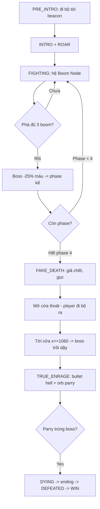

### 4.2. Asset → gameplay

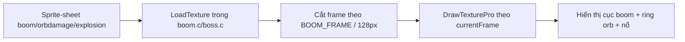

---

## 5. Gameplay Loop

### 5.1. Game loop (theo `main.c`)

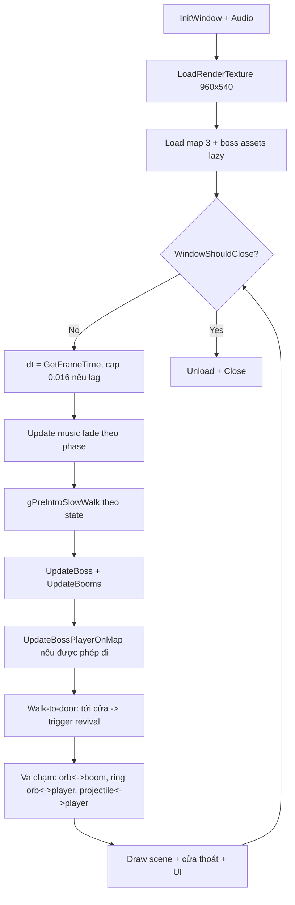

### 5.2. Update FIGHTING chi tiết

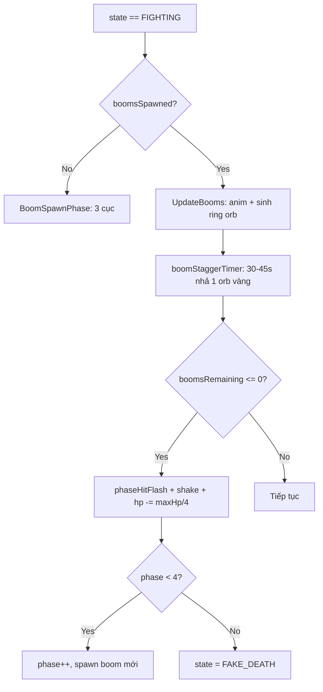


---

## 6. Boss State Machine (8 trạng thái)

`BossState` trong `boss.h` hiện có **8** trạng thái (thêm `FAKE_DEATH` và `TRUE_ENRAGE`):

| State | Ý nghĩa | Ghi chú |
| --- | --- | --- |
| `BOSS_PRE_INTRO` | Mèo đi chậm tới beacon, màn tối → sáng | đi-bộ-only |
| `BOSS_INTRO` | Boss trồi lên từ dưới | đồng bộ `start.ogg` |
| `BOSS_ROAR` | Boss hét + shake | hiện "A G I S", `laugh.ogg` |
| `BOSS_FIGHTING` | Combat chính (hệ Boom Node) | spawn boom theo phase |
| `BOSS_FAKE_DEATH` | **Mới**: giả chết → mở cửa → chờ player ra → hồi sinh | xem Mục 9 |
| `BOSS_TRUE_ENRAGE` | **Mới**: 1 HP, bullet hell, parry kết liễu thật | xem Mục 10 |
| `BOSS_DYING` | HP=0 thật, chờ nhạc ending | `ending.ogg` |
| `BOSS_DEFEATED` | Sau ending: explosion + fade | `deathTimer >= 4` → WIN |

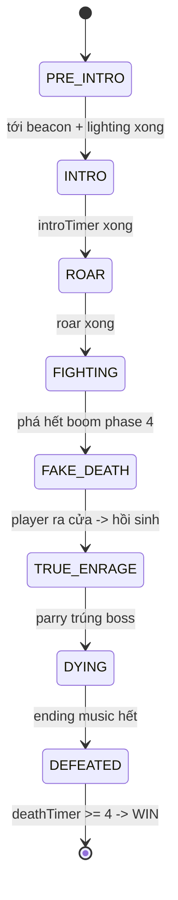


---

## 7. Hệ Boom Node (cốt lõi mới)

### 7.1. Ý tưởng

Boss **không** mất máu khi bị đánh trực tiếp. Thay vào đó, mỗi phase boss triệu hồi **3 cục boom** (`BOOM_PER_PHASE = 3`). Mỗi cục là một "điểm yếu tạm thời" sinh đòn hại player. Phá đủ cả 3 cục → boss "dính sát thương" (`hp -= maxHp/4`) → qua phase. Hết phase 4 → vào chuỗi giả chết.

### 7.2. Vòng đời 1 cục boom (`BoomState`)

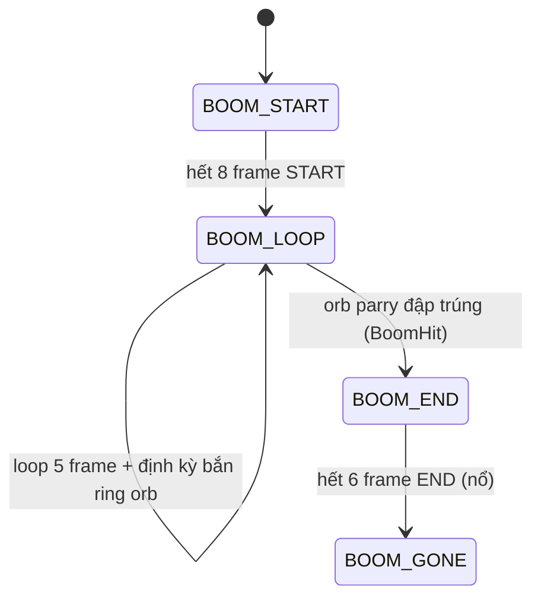

### 7.3. Asset cục boom (3 part)

| Part | File | Frame | Vai trò |
| --- | --- | ---: | --- |
| START | `effects/boom/part1(start)/sprite-sheet.png` | 8 | Hiện lên |
| LOOP | `effects/boom/part2(loop)/sprite-sheet.png` | 5 | Đứng sinh đòn |
| END | `effects/boom/part3(end)/sprite-sheet.png` | 6 | Nổ biến mất |

`BOOM_FRAME = 128` (mỗi frame 128x128, xếp ngang), `BOOM_FRAME_TIME = 0.09s`.

### 7.4. Vị trí 3 cục theo phase (`BoomPositions`)

Vị trí của 3 cục boom được tính toán hoàn toàn động trên mỗi lần chuyển phase thông qua hàm `BoomPositions()`. Công thức tính khoảng cách lan rộng (`spread`) tỷ lệ thuận với phase hiện tại để tăng dần độ thử thách (buộc người chơi phải di chuyển nhiều hơn ở các phase cao):

```c
float cy = 230.0f;                       // Cao độ cố định trên không trung
float spread = 250.0f + phase * 25.0f;   // Phase 1: 250px, Phase 2: 275px, Phase 3: 300px, Phase 4: 325px
float cx = 640.0f;                       // Tâm sân đấu
out[0] = (Vector2){ cx - spread, cy + 20.0f };  // Cục TRÁI (hơi thấp)
out[1] = (Vector2){ cx,          cy - 30.0f };  // Cục GIỮA (hơi cao)
out[2] = (Vector2){ cx + spread, cy + 20.0f };  // Cục PHẢI (hơi thấp)
```

### 7.5. Vòng đạn đỏ có khe né (Ring damage-orb)

Mỗi cục boom ở trạng thái `BOOM_LOOP`, sau khi đếm ngược hết `attackTimer` (ngẫu nhiên từ `3.5s` đến `5.5s` cộng thêm offset trễ giữa các cục để tránh bắn đồng loạt), sẽ kích hoạt chuỗi bắn vòng đạn đỏ:

* **Công thức phân bố góc**: Sử dụng hàm `FireRing(pos, count, speed, gapAngle, gapWidth)`. Phân bố tròn từ $0 \rightarrow 2\pi$ với số lượng đạn tăng dần theo phase: `count = 8 + phase * 2` (Phase 1: 8 viên, Phase 4: 14 viên).
* **Khe né động (Gap logic)**: Chừa lại 2 khe trống đối xứng nhau tại `gapAngle` và `gapAngle + PI` với bề rộng khe hẹp dần theo phase: `gapW = 0.55f - phase * 0.06f` radian (tối thiểu `0.35f` radian). Khe hẹp hơn đòi hỏi player phải đứng rất chính xác ở tâm khe để không bị trướng đạn.
* **Cảnh báo đứng yên (Telegraph hold)**: Tất cả đạn khi sinh ra sẽ có trạng thái đứng yên tại chỗ (`holdTimer = 2.0s`) và nhấp nháy phát sáng đỏ-hồng để báo trước vị trí và khe né cho player. Trong 2 giây này, đạn **không gây damage** (được kiểm tra bằng cờ `holdTimer > 0` trong va chạm). Sau 2 giây, đạn bắt đầu bay ra ngoài với vận tốc `speed = 150.0f + phase * 25.0f` pixel/giây.

### 7.6. Vai trò 3 cục boom theo phase (CẬP NHẬT)

Từ Phase 2 trở đi, 3 cục boom **không còn cùng bắn đạn đỏ** nữa mà chia vai (gán theo index trong `BoomSpawnPhase`):

| Cục | Index | Phase 1 | Phase >= 2 |
| --- | :---: | --- | --- |
| **TRÁI** | 0 | Ring đạn đỏ | **LASER BEAM (Tự động)**: vạch telegraph mảnh cảnh báo nhấp nháy xoay theo player `1.2s` $\rightarrow$ khóa hướng và bắn luồng laser dày `0.45s` (hitbox `BEAM_WIDTH=48`). |
| **GIỮA** | 1 | Ring đạn đỏ | **Ring đạn đỏ** (giữ nguyên — nguồn bắn vòng đạn đỏ có khe né duy nhất). |
| **PHẢI** | 2 | Ring đạn đỏ | **LASER BEAM (Tự động)**: Tương tự cục TRÁI, tự động bắn tia laser xoay và khóa hướng player (hitbox `BEAM_WIDTH=48`). |

- Cả 3 cục vẫn hiển thị + vẫn **phá được bằng orb vàng** như nhau.
- Va chạm beam laser với player nằm trong `CheckPlayerInBoomRings` (sử dụng hàm kiểm tra khoảng cách từ điểm đến đoạn thẳng `DistPointSeg` giữa player và tia laser).
- Trạng thái kỹ năng laser của các cục boom được lưu trong các mảng nội bộ của `boom.c`: `beamTelegraph[BOOM_PER_PHASE]`, `beamFire[BOOM_PER_PHASE]`, và `beamDir[BOOM_PER_PHASE]`; tự dọn dẹp khi cục nổ (`ClearBoomSkill`).
- **Cân bằng cơ chế (Fairness Balance):** Nhằm cân bằng độ khó, các tia laser tự động này chỉ xoay/theo dõi player trong pha telegraph (cảnh báo). Khi bắt đầu phát hỏa (firing), góc bắn sẽ hoàn toàn cố định để người chơi có cơ hội né tránh.

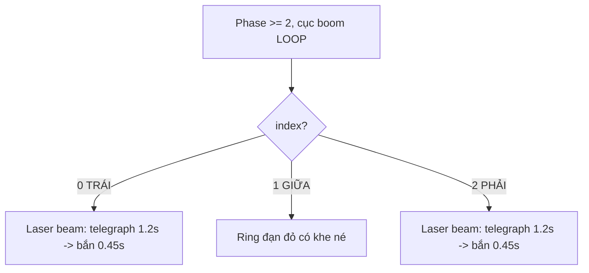

### 7.7. Cơ Chế Bắn Laser Từ Boom Node (Chi Tiết Vật Lý & Đồ Họa)

Tia laser của boom node hoạt động phức tạp dựa trên thuật toán dò vết (raycasting) và kỹ thuật dựng hình phân tách kết cấu:

#### A. Thuật toán Raycasting chiều dài Laser (`GetBeamLength`)
Do các boom node nằm lơ lửng trên không trung trong khi mặt đất bên dưới gồ ghề và có các platform phụ, chiều dài của tia laser phải được tính toán động theo thời gian thực. Hàm `GetBeamLength(start, dir)` thực hiện thuật toán **raymarching** dọc theo vector hướng `dir`:
1. Bắt đầu từ tọa độ `start` (vị trí cục boom).
2. Lặp tiến thêm từng bước dài `10.0f` pixel: $P_t = start + dir \times t$.
3. Tại mỗi bước, truy vấn độ cao thực tế của địa hình tại hoành độ $P_t.x$ bằng hàm `BossGetGroundY(P_t.x)`.
4. Nếu tung độ tia laser $P_t.y \ge GroundY$, tia laser chính thức va chạm đất. Chiều dài tia tại điểm đó $t$ được chọn làm chiều dài giới hạn.

#### B. Phép nội suy bám đuổi Player (Telegraph Tracking)
Trong suốt 1.2 giây telegraph (`beamTelegraph[i] > 0.0f`), hướng bắn `beamDir[i]` liên tục xoay theo người chơi. Để tránh việc tia xoay giật cục, hướng bắn được cập nhật mượt bằng phép nội suy tuyến tính (lerp) hướng:
$$\vec{T} = \text{Normalize}(P_{\text{player}} - P_{\text{boom}})$$
$$\vec{D}_{\text{new}} = \vec{D}_{\text{current}} + (\vec{T} - \vec{D}_{\text{current}}) \times dt \times \text{trackSpeed}$$
Với `trackSpeed = 3.0f` (đối với laser bắn tự động) hoặc `4.5f` (đối với kỹ năng Triple Tracking Lasers). Sau đó vector $\vec{D}_{\text{new}}$ sẽ được chuẩn hóa lại để giữ độ dài bằng 1.

#### C. Kỹ thuật Render Luồng Laser (`DrawTexturePro` body/head)
Khi bắn (`beamFire[i] > 0.0f`), luồng laser được dựng bằng ảnh động `boomLaserTex` (kích thước frame nguồn $300 \times 1309$ pixel). Để tránh luồng laser bị méo mó co giãn kỳ dị khi chiều dài thay đổi, kết cấu được chia đôi và vẽ làm 2 phần:
1. **Thân laser (Body - co giãn)**: Cắt phần thân trên của frame nguồn (từ $Y = 0$ đến $Y = 1009$). Phần này được vẽ kéo giãn dọc theo chiều dài luồng tia thực tế, biểu diễn luồng năng lượng truyền từ boom node xuống đất.
2. **Đầu laser (Head - giữ nguyên tỷ lệ)**: Cắt phần đầu vụ nổ dưới cùng của frame nguồn (từ $Y = 1009$ đến $Y = 1309$, chiều cao 300px). Đầu laser được dịch chuyển đến điểm tiếp đất và vẽ giữ nguyên tỷ lệ chiều rộng/dài gốc nhằm bảo toàn hoạt ảnh vụ nổ và hiệu ứng xung kích năng lượng tại điểm chạm đất.
3. **Hiệu ứng mờ dần (Fade out)**: Trong 0.15s cuối cùng của thời gian bắn, alpha tint của laser được giảm tuyến tính xuống 0 (`alpha = beamFire[i] / 0.15f`) để tạo hiệu ứng tắt laser tự nhiên.


---

## 8. Cơ Chế Orb Parry Phá Boom

### 8.1. Luồng orb vàng (đã đổi so với bản "bắt orb")

Boss định kỳ (`boomStaggerTimer`, mỗi **30–45s**) nhả **1 orb vàng**. Orb **rơi xuống đất**, player **đi tới lụm** (chạm), orb **bay lên** đập vào **cục boom gần nhất** (`BoomNearestActive`) làm cục đó nổ (`BoomHit`).

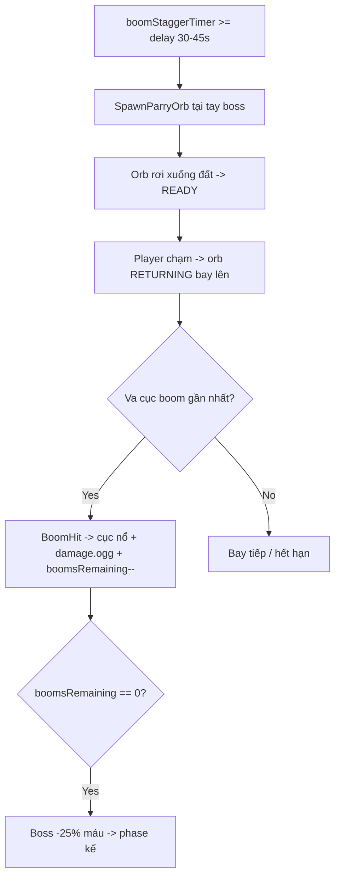


### 8.2. Vì sao orb thưa (30–45s)

Để **kéo dài gameplay** và buộc player phải sống sót qua nhiều đợt ring orb giữa các lần có orb vàng. Đây là điều chỉnh chủ ý: ít orb = mỗi orb quý = mỗi cú parry phải chính xác.

### 8.3. Trong TRUE_ENRAGE

Cùng cơ chế parry nhưng mục tiêu đổi: orb RETURNING **trúng `boss.hurtBox`** → `BossTakeDamage` → boss chết thật (xem Mục 10).

### 8.4. Công thức vật lý & chuyển động của Orb vàng

Vòng đời của hạt Orb vàng (`OrbState`) bao gồm các trạng thái `ORB_FALLING` $\rightarrow$ `ORB_READY` $\rightarrow$ `ORB_RETURNING` $\rightarrow$ `ORB_INACTIVE` với các đặc điểm động lực học như sau:

#### A. Trạng thái rơi tự do (`ORB_FALLING`)
Hạt Orb vàng được sinh ra từ tay boss và chịu gia tốc trọng trường mô phỏng để rơi xuống đất:
$$v_y = v_y + 350.0f \times dt$$
$$y = y + v_y \times dt$$
Tia kiểm tra độ cao mặt đất (`ground`) được thực hiện liên tục. Khi $y \ge ground - 5.0f$, Orb sẽ bị giữ lại tại mặt sàn, đặt vận tốc về 0, chuyển trạng thái sang `ORB_READY` và bắt đầu tích lũy `lifeTimer` để tự hủy sau 15 giây nếu người chơi bỏ qua không nhặt.

#### B. Pha nhặt Orb (`TryCatchOrb`)
Khi người chơi di chuyển chạm vào Orb, hàm `TryCatchOrb` liên tục kiểm tra va chạm giữa hộp sát thương của player (`playerHurtBox`) và hitbox của Orb (`orb->hitbox`):
$$\text{Va chạm} = \text{CheckCollision}(Hitbox_{\text{orb}}, Hurtbox_{\text{player}})$$
Nếu có va chạm, trạng thái chuyển thành `ORB_RETURNING`, reset vận tốc và lưu trữ tọa độ mục tiêu `targetPos` (là boom node gần nhất hoặc boss).

#### C. Pha bay ngược tìm mục tiêu (`ORB_RETURNING`)
Orb chuyển sang chế độ tự hành từ vị trí hiện tại bay thẳng về mục tiêu mà không bị ảnh hưởng bởi trọng lực:
$$\vec{D} = P_{\text{target}} - P_{\text{orb}}$$
$$\vec{V} = \text{Normalize}(\vec{D}) \times \text{ORB\_RETURN\_SPEED}$$ (với `ORB_RETURN_SPEED = 600.0f` pixel/giây).
Tọa độ di chuyển: $P_{\text{orb}} = P_{\text{orb}} + \vec{V} \times dt$. Khoảng cách đến mục tiêu được giám sát liên tục; khi $|\vec{D}| < 40.0f$ pixel, Orb kích nổ đập tan mục tiêu và chuyển về `ORB_INACTIVE` để giải phóng bộ nhớ.

---

## 9. Cú Lừa Giả Chết → Đi Ra Cửa → Hồi Sinh

Đây là điểm nhấn tường thuật mới, xử lý chéo giữa `boss.c` (logic + visual boss) và `main.c` (cửa thoát + cho player đi).

### 9.1. Ba giai đoạn trong `BOSS_FAKE_DEATH`

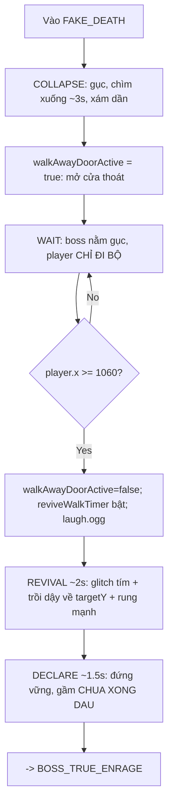

### 9.2. Cờ điều khiển (trong `Boss`)

| Field | Ý nghĩa |
| --- | --- |
| `fakeDeathTimer` | Đếm giai đoạn COLLAPSE (0→3s) |
| `walkAwayDoorActive` | true: cửa thoát đang mở, player đi bộ ra |
| `reviveWalkTimer` | >0: đã qua cửa, đang REVIVAL/DECLARE |

### 9.3. Phối hợp với `main.c`

- **Đi-bộ-only:** `gPreIntroSlowWalk = (state==PRE_INTRO) || (state==FAKE_DEATH && walkAwayDoorActive)` → `boss_player.c` cấm nhảy + cấm đánh.
- **Cho player di chuyển** trong FAKE_DEATH khi cửa mở (thêm điều kiện vào nhánh `UpdateBossPlayerOnMap`).
- **Trigger hồi sinh:** khi `walkAwayDoorActive` và `player.x >= 1060` → tắt cửa, set `reviveWalkTimer = 0.0001f`, phát `laugh.ogg`.
- **Vẽ cửa thoát (đã đồng bộ):** dùng đúng **cửa gỗ thật trên map** ở `doorX = 1080` (bỏ cửa vòm "giả" lệch tọa độ của bản trước). Chỉ vẽ hào quang vàng nhấp nháy quanh cửa + mũi tên `>>` cạnh mèo + dòng nhắc "Di ra cua thoat ben phai →". Cả bản tích hợp `src/main.c` lẫn standalone `boss/src/main.c` dùng chung `doorX=1080` / trigger `x>=1060`.

### 9.4. Overlay tường thuật (UI trong `main.c`)

| Giai đoạn | Overlay |
| --- | --- |
| COLLAPSE (t<3s) | Tối dần + chữ "VICTORY?" mờ hiện (đánh lừa) |
| REVIVAL | Glitch đỏ nhấp nháy + dải nhiễu ngang |
| DECLARE | Nhuốm tím/đỏ + chữ "IT'S NOT OVER!" |


---

## 10. TRUE_ENRAGE Và Kết Liễu Thật

### 10.1. Cơ chế

Sau hồi sinh, boss vào `BOSS_TRUE_ENRAGE`:

- `hp = 1`, `phase = BOSS_PHASE_4`.
- Bắn **barrage 360°** mỗi **1.6s** (bullet hell).
- Nhả **orb parry** mỗi `orbInterval` (≈2.0s).
- Player parry orb → orb RETURNING trúng `boss.hurtBox` → `BossTakeDamage` → `state = BOSS_DYING` (chết thật).

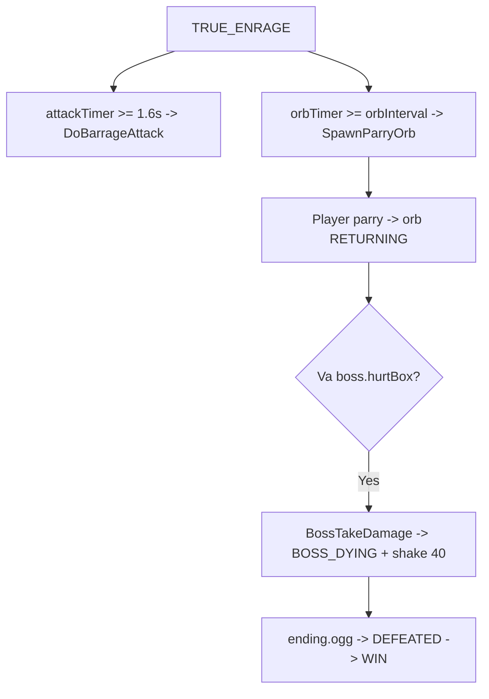


### 10.2. `BossTakeDamage` ưu tiên TRUE_ENRAGE

```c
void BossTakeDamage(Boss *boss, int damage) {
    if (boss->state == BOSS_TRUE_ENRAGE) {
        boss->hp = 0;
        boss->state = BOSS_DYING;       // 1 phát parry là chết thật
        boss->shakeTimer = 0.5f;
        boss->shakeIntensity = 40.0f;
        return;
    }
    // ... (logic cũ: lần HP=0 đầu tiên -> FAKE_DEATH)
}
```

---

## 11. Animation Chết Của Boss (làm lại)

Bản cũ vẽ 30 đốm random + nhiều vòng tròn → rối mắt. Bản mới gọn, điện ảnh (trong `DrawBossBody` khi `boss->defeated`):

| Thành phần | Mô tả |
| --- | --- |
| Thân boss | Chìm xuống (`sink`) + nghiêng (`tilt`) theo ease-out, tint tím → xám tối, mờ dần |
| Chớp trắng | 1 lần ngắn 0.25s lúc bắt đầu |
| Vòng xung kích | **3 vòng đều** lan ra tuần tự (cách nhau 0.45s), màu tím |
| Explosion sprite | **3 cụm** nổ tuần tự ở vị trí cố định trên thân (offset cố định) |

```c
float dp = boss->deathTimer / 4.0f;          // 0..1
float ease = 1.0f - powf(1.0f - dp, 2.0f);   // ease-out
float sink = ease * 60.0f;
float tilt = ease * 18.0f;
// tint tím -> xám, alpha = (1-dp)*255
```


---

## 12. Hệ Thống Tấn Công Theo Đợt (Round-based Skill System - Đã bật từ Phase 2)

> **CẬP NHẬT:** Thay vì kích hoạt các chiêu thức lớn chồng chéo ngẫu nhiên gây quá khó cho người chơi, từ Phase 2 boss sử dụng hệ thống **tấn công theo đợt (Round-based Skill System)**. Mỗi đợt (round) chỉ chọn duy nhất một kỹ năng lớn và thực hiện liên tục **5 lần** (5 casts). Khi hoàn thành đợt, boss mới chọn kỹ năng tiếp theo.

### 12.1. Logic hoạt động trong `UpdateBoss` (FIGHTING):

```c
// Bật kỹ năng tự động từ Phase 2; Phase 1 chỉ có đạn đỏ từ boom.
if (boss->phase >= BOSS_PHASE_2 && boss->attackTimer >= boss->attackInterval && !anySkillActive) {
    boss->attackTimer = 0;
    
    // Khởi động đợt skill mới (5 lần cast) nếu đợt cũ đã xong
    if (!boss->skillRoundActive) {
        boss->skillRoundType = ChooseNewRoundAttack(boss);
        boss->skillRoundActive = true;
        boss->skillRoundCastCount = 0;
    }
    
    AttackType atk = boss->skillRoundType;
    
    switch (atk) {
        case ATTACK_PROJECTILE: DoProjectileAttack(boss, playerPos, pm); break;
        case ATTACK_LASER:      StartLaserAttack(boss, playerPos); break;
        case ATTACK_SLAM:       StartSlamAttack(boss, playerPos); break;
        case ATTACK_HAZARD:     StartHazardAttack(boss); break;
        case ATTACK_CLAW:       StartClawAttack(boss, playerPos); break;
        case ATTACK_BARRAGE:    DoBarrageAttack(boss, pm); break;
        case ATTACK_RAIN:       StartRainAttack(boss); break;
        case ATTACK_BOOM_CHAOTIC_LASERS:      BoomTriggerChaoticLasers(boss); break;
        case ATTACK_BOOM_TRIPLE_TRACK_LASERS: BoomTriggerTripleTrackLasers(boss); break;
    }
    
    boss->skillRoundCastCount++;
    if (boss->skillRoundCastCount >= 5) {
        boss->skillRoundActive = false;
        boss->lastRoundType = boss->skillRoundType; // Ghi nhớ để tránh spam lặp lại ở đợt kế
    }
    
    boss->lastAttack = atk;
    boss->attackCooldowns[(int)atk] = ATTACK_COOLDOWN_TABLE[(int)atk];
}
```

### 12.2. Chiêu thức khả dụng theo Phase (`ChooseNewRoundAttack`):

| Phase | Kỹ năng có thể được chọn cho đợt tấn công |
| --- | --- |
| **Phase 1** | *(Không tự đánh kỹ năng lớn — chỉ có đạn đỏ tự động từ boom)* |
| **Phase 2** | Laser, Slam |
| **Phase 3** | Laser, Slam, Claw, Hazard, **Boom Chaotic Lasers**, **Boom Triple Tracking Lasers** |
| **Phase 4** | Laser, Slam, Claw, Hazard, **Boom Chaotic Lasers**, **Boom Triple Tracking Lasers**, Rain |

*Chú ý: `ATTACK_PROJECTILE` không còn xuất hiện trong pool chọn đợt lớn, chỉ giữ vai trò làm giá trị khởi tạo. Chiêu `ATTACK_BARRAGE` (Radial Burst) được dành riêng cho trạng thái `BOSS_TRUE_ENRAGE`.*

### 12.3. Bảng Cooldown Kỹ Năng (`ATTACK_COOLDOWN_TABLE`):

| Kỹ năng | Cooldown (giây) | Mô tả |
| --- | :---: | --- |
| `PROJECTILE` | 0.5s | Bắn đạn thường |
| `LASER` | 4.0s | Tia laser khổng lồ từ boss |
| `SLAM` | 3.0s | Đập tay tạo vòng xung kích dưới đất |
| `HAZARD` | 5.0s | Gai nhọn gai vách xuất hiện trên sân đấu |
| `CLAW` | 3.0s | Vuốt cào góc hoặc giữa sân đấu |
| `BARRAGE` | 6.0s | Bắn vòng tròn đạn hell (True Enrage dùng mỗi 1.6s) |
| `RAIN` | 5.0s | Mưa đạn đỏ dội xuống từ trên trời |
| `BOOM_CHAOTIC_LASERS` | 5.0s | Cả 3 cục boom bắn laser ngẫu nhiên hướng xuống |
| `BOOM_TRIPLE_TRACK_LASERS` | 6.0s | Cả 3 cục boom cùng chiếu tia laser đuổi theo player |

> **Thiết kế công bằng (Fairness):** Nhờ cơ chế này, người chơi sẽ không phải đối mặt với combo "Laser + Mưa đạn + Gai vách" cùng một lúc. Tuy nhiên, các kỹ năng tự động nội tại của boom (như laser beam của cục Trái/Phải và đạn đỏ của cục Giữa) vẫn diễn ra song song với đợt chiêu lớn của boss.

### 12.4. Phân Tích Chi Tiết 9 Chiêu Thức Của Boss (Thuật Toán & Va Chạm)

Dưới đây là mô tả chi tiết logic mã nguồn, tham số thời gian, công thức toán học và cách kiểm tra va chạm của 9 kỹ năng tấn công:

#### 1. `ATTACK_PROJECTILE` (Đạn Đỏ Hướng Mục Tiêu)
* **Logic phát triển**: Boss bắn các luồng đạn đỏ từ một trong hai tay (trái hoặc phải) hướng thẳng về phía người chơi. Cấu hình luồng đạn thay đổi theo từng Phase:
  * **Phase 1**: Bắn 1 viên đạn đơn với tốc độ cơ bản `PROJECTILE_SPEED_BASE = 250.0f`.
  * **Phase 2**: Tăng tốc độ đạn lên $1.1\times$ và bắn 3 viên dạng hình quạt (fan) lệch nhau góc $\pm 0.3$ radian quanh vector hướng.
  * **Phase 3**: Tăng tốc độ đạn lên $1.15\times$ và bắn 3 viên quạt rộng, lệch nhau góc $\pm 0.25$ radian.
  * **Phase 4**: Tăng tốc độ đạn lên $1.25\times$ và bắn 5 viên quạt lệch nhau góc $\pm 0.2$ radian.
* **Va chạm**: Sử dụng kiểm tra va chạm hình chữ nhật AABB giữa hitbox của viên đạn và hộp sát thương (hurtbox) của player.

#### 2. `ATTACK_LASER` (Tia Laser Khổng Lồ Từ Boss)
* **Logic phát triển**: Laser năng lượng cao phát ra từ ngực boss hướng xuống mặt sàn platform.
  * **Pha Warning (2.0s)**: Lock vị trí X của player trên sàn platform: $P_{\text{end}} = (x_{\text{player}}, GetSurfaceYAtX(x_{\text{player}}))$. Vẽ đường chỉ đỏ nhấp nháy mảnh biểu diễn luồng laser cảnh báo. Player có 2s chạy ra khỏi luồng này.
  * **Pha Firing (2.0s)**: Hướng bắn được chuẩn hóa cứng: $\vec{D} = \text{Normalize}(P_{\text{end}} - P_{\text{start}})$. Tọa độ điểm đầu cuối $P_{\text{end}}$ kéo dài dần dọc theo $\vec{D}$ với vận tốc `LASER_EXTEND_SPEED = 300.0f` pixel/giây cho đến khi chạm sát mép bản đồ (hoặc hết thời gian).
* **Va chạm**: Hàm `CheckPlayerInLaser()` chiếu điểm thân player lên đoạn thẳng laser từ $P_{\text{start}} \rightarrow P_{\text{end}}$. Va chạm xảy ra khi khoảng cách vuông góc từ player đến tâm laser nhỏ hơn một nửa độ rộng tia (`width / 2.0f`).

#### 3. `ATTACK_SLAM` (Cú Đập Tay Tạo Sóng Xung Kích)
* **Logic phát triển**: Boss đập mạnh tay xuống platform tại vị trí hiện tại của player.
  * **Pha Warning (2.0s)**: Khóa tọa độ mục tiêu trên mặt đất: $P_{\text{target}} = (x_{\text{player}}, GetSurfaceYAtX(x_{\text{player}}))$. Hiển thị vùng cảnh báo màu vàng nhấp nháy dưới chân.
  * **Pha Firing (1.0s)**: Tạo sóng xung kích tròn lan tỏa từ $P_{\text{target}}$ với bán kính tăng dần theo thời gian.
* **Va chạm**: Hàm `CheckPlayerInShockwave()` kiểm tra khoảng cách Euclide giữa player và điểm đập $P_{\text{target}}$. Người chơi chỉ bị dính sát thương nếu nằm đúng trong **vành tròn** (ring) sóng xung kích có độ rộng 40px:
$$\text{Hit} \iff (dist < radius) \land (dist > radius - 40.0f)$$

#### 4. `ATTACK_HAZARD` (Cột Gai Nhọn Địa Hình)
* **Logic phát triển**: Triệu hồi từ 3 đến 5 cột gai nhọn nhô lên từ mặt đất cản đường và gây sát thương.
  * Hoành độ của từng gai $x_i$ được chọn ngẫu nhiên trong khoảng $[120.0f, 1160.0f]$ và tung độ khớp với cao trình của địa hình $GetSurfaceYAtX(x_i)$.
  * Để tránh việc toàn bộ gai nhô lên đồng loạt khiến người chơi không kịp phản xạ, thời gian cảnh báo của từng gai được gán lệch pha nhau $0.35s$: $Warning_i = HAZARD\_WARNING\_TIME + i \times 0.35f$.
* **Va chạm**: Khi warning của gai kết thúc, gai trồi lên và kích hoạt hitbox AABB. Player va chạm với hitbox này sẽ bị mất máu.

#### 5. `ATTACK_CLAW` (Cú Cào Móng Vuốt Đàn Áp)
* **Logic phát triển**: Boss cào mạnh một khu vực cực lớn trên đấu trường. Sân đấu được chia thành 3 vùng quét ngang: LEFT ($[20, 440]$), MIDDLE ($[440, 840]$), và RIGHT ($[840, 1260]$).
  * **Trí tuệ nhân tạo dự đoán**: Khi kích hoạt, boss có 70% cơ hội tự động chọn vùng mà player đang đứng để cào, và 30% chọn ngẫu nhiên vùng khác để đánh lừa.
  * Thời gian cảnh báo là `0.8s` (clawWarningTime) $\rightarrow$ sau đó móng vuốt càn quét vùng đó trong `0.6s` (clawDuration) kèm hiệu ứng rung màn hình rất mạnh (`intensity = 20.0f`).
* **Va chạm**: Hàm `CheckPlayerInClawZone()` kiểm tra xem hoành độ $x$ của player có nằm trong khoảng giới hạn của vùng đang bị cào quét hay không.

#### 6. `ATTACK_BARRAGE` (Radial Bullet Hell Burst - Chỉ Enrage)
* **Logic phát triển**: Bắn ra 12 viên đạn đỏ tỏa tròn 360 độ từ hai bàn tay của Agis để tạo màn mưa đạn dày đặc khó né:
  * 6 viên đạn xuất phát từ tay Trái với các góc phân bổ đều: $\theta_i = \frac{2\pi}{12} \times i$ (với $i \in [0, 5]$).
  * 6 viên đạn xuất phát từ tay Phải với góc lệch pha đan xen: $\theta_j = \frac{2\pi}{12} \times j + \frac{2\pi}{24}$.
  * Vận tốc đạn đạt `PROJECTILE_SPEED_BASE * 1.1f`.
* **Va chạm**: Sử dụng kiểm tra va chạm AABB của từng viên đạn với player.

#### 7. `ATTACK_RAIN` (Mưa Đạn Dội Từ Trên Trời)
* **Logic phát triển**: Kích hoạt cơn mưa đạn đỏ dội thẳng từ đỉnh màn hình xuống đất.
  * Cảnh báo warning trong `2.0s`.
  * Sau warning, cơn mưa đạn kéo dài `3.0s`. Cứ mỗi chu kỳ `0.3s`, một viên đạn mới được sinh ra tại tung độ phía trên màn hình $y = -20.0f$ với hoành độ ngẫu nhiên $x \in [50.0f, 1230.0f]$ và rơi thẳng đứng xuống dưới với vận tốc `350.0f` pixel/giây.
* **Va chạm**: Kiểm tra va chạm AABB của từng viên đạn rơi với player.

#### 8. `ATTACK_BOOM_CHAOTIC_LASERS` (Hệ Cục Boom Bắn Laser Loạn Xạ)
* **Logic phát triển**: Kích hoạt đồng loạt cả 3 cục boom tự động bắn tia laser hướng xuống sàn đấu.
  * Thời gian telegraph cảnh báo mảnh là `1.2s` và thời gian bắn laser là `0.6s`.
  * Góc bắn $\theta$ của mỗi cục boom được gán hoàn toàn ngẫu nhiên chĩa xuống dưới trong khoảng từ $36^\circ$ đến $144^\circ$ ($\theta \in [0.2\pi, 0.8\pi]$).
* **Va chạm**: Sử dụng hàm va chạm đoạn thẳng `DistPointSeg`.

#### 9. `ATTACK_BOOM_TRIPLE_TRACK_LASERS` (Ba Cục Boom Bắn Laser Bám Đuổi)
* **Logic phát triển**: Ba cục boom đồng loạt kích hoạt tia laser chiếu thẳng vào người chơi.
  * Trong pha cảnh báo `1.2s`, cả 3 tia laser xoay và bám theo tọa độ của player với tốc độ bám đuổi nhanh `trackSpeed = 4.5f`.
  * Khi đếm ngược telegraph kết thúc, cả 3 tia khóa cứng hướng và phát hỏa luồng laser khổng lồ trong `2.0s`.
* **Va chạm**: Sử dụng hàm va chạm đoạn thẳng `DistPointSeg`.

---

## 13. Statue System (đã tắt gameplay)

Tượng (`MapStatue`, `MAX_MAP_STATUES = 8`) vẫn được parse từ Tiled layer `statue` và có đủ animation 4 state, nhưng **gameplay đã bị bỏ**:

- Tượng luôn `STATUE_INACTIVE`, **không kích hoạt**, **không đánh được**.
- Chỉ còn là **vật trang trí tĩnh** do Tiled vẽ.
- Hàm `BossCheckStatueHits` / `BossResolveStatueCollision` còn tồn tại nhưng không còn là cơ chế đánh boss.

> Trong source có chú thích rõ: "Tượng không còn là cơ chế đánh boss nữa (đã bỏ theo yêu cầu)."

---

## 14. Player, Đi-Bộ-Only Và Cheat

### 14.1. Đi-bộ-only (cấm nhảy + đánh)

`boss_player.c` đọc cờ `gPreIntroSlowWalk`. Khi bật (pre-intro **hoặc** đi ra cửa):

```c
if (gPreIntroSlowWalk) {
    currentSpeed = 100.0f;   // đi chậm
    // CẤM nhảy:
    // if (!gPreIntroSlowWalk && (Space/W/Up) ...) -> bị chặn
    // CẤM đánh chuột trái:
    // if (!gPreIntroSlowWalk && IsMouseButtonPressed(LEFT) ...) -> bị chặn
}
```

### 14.2. Input chính

| Hành động | Phím |
| --- | --- |
| Di chuyển | `A`/`D` hoặc `←`/`→` |
| Nhảy | `Space` / `W` / `↑` (bị cấm khi đi-bộ-only) |
| Sprint x1.8 | giữ `Left Shift` |
| Parry / đánh | Chuột trái (bị cấm khi đi-bộ-only) |
| Retry | `R` (sau Win/Lose) |

### 14.3. Cheat NINELIVES (God Mode)

Logic trong `boss_player.c` (`UpdateCheatBuffer`): gõ `NINELIVES` (không phân biệt hoa thường) → toggle `godMode` → hiện "GOD MODE: ON/OFF" 3s. God Mode chặn mọi sát thương (gồm cả force-kill atom bomb cũ).


---

## 15. Camera Và Render

### 15.1. Camera (đã sửa giật + thấy boom)

- `camera.c`: smooth-damped (`1 - exp(-stiffness*dt)`) + shake.
- Khi vào FIGHTING: **zoom out ≈ 0.95** (trước là ~1.13) để thấy cả 3 cục boom + cửa thoát.
- Target theo player với offset y nhẹ.

**SHAKE LÀM MƯỢT (đã sửa lỗi giật lag):** trước đây shake dùng `GetRandomValue`/`rand()` **random mỗi frame** áp thẳng vào target/offset → khung hình nhảy loạn, giật lag rất khó chịu (càng rõ khi zoom out). Nay thay bằng **dao động sin đa tần số theo thời gian** + biên độ giảm dần + clamp tối đa 14px:

```c
// camera.c (bản tích hợp) và boss/src/main.c (standalone) dùng chung ý tưởng:
float t = (float)GetTime();
float s = magnitude * decay;   // decay theo thời gian còn lại
if (s > 14.0f) s = 14.0f;      // clamp biên độ
offset.x = (sinf(t*47.0f) + 0.5f*sinf(t*23.0f)) * s;
offset.y = (cosf(t*41.0f) + 0.5f*cosf(t*19.0f)) * s;
```

Kết quả: rung liên tục, êm, tự nhiên thay vì nhảy random từng frame.

### 15.2. Render

`RenderTexture2D` nội bộ → vẽ lên window. Thứ tự vẽ map: sky → mountain → building → boss body → foreground → player → cửa thoát → boom/orb/projectile → UI.

---

## 16. Âm Thanh Và UI HUD

### 16.1. Audio path (trong `main.c`)

| File | Loại | Dùng khi |
| --- | --- | --- |
| `boss/assets/audio/music/start.ogg` | Music (no loop) | Intro boss |
| `.../background/phrase1and2.ogg` | Music (loop) | Phase 1 & 2 |
| `.../background/phrase3.ogg` | Music (loop) | Phase 3 |
| `.../background/phrase4.ogg` | Music (loop) | Phase 4 |
| `.../background/ending.ogg` | Music (no loop) | DYING |
| `.../sfx/laugh.ogg` | Sound | ROAR + boss hồi sinh ở cửa |
| `.../sfx/damage.ogg` | Sound | Orb đập trúng boom / boss |
| `.../sfx/alarm.ogg` | Sound | (warning các chiêu cũ — phần lớn đã tắt) |
| `.../sfx/hits.ogg` | Sound | Player lụm/parry orb |
| `.../sfx/slash.ogg` | Sound | Parry slash |

### 16.2. HUD

| HUD | Mục đích |
| --- | --- |
| Boss HP / Player HP | `DrawUI` |
| Phase text | "Phase 1..4" / "TRUE FINAL - PARRY TO KILL!" |
| Taunt | Text trên đầu boss |
| God Mode | Góc phải khi cheat bật |
| Cửa thoát + nhắc | "Di ra cua thoat ben phai →" khi walk-away |
| Overlay cutscene | "VICTORY?" / "IT'S NOT OVER!" |
| Win/Lose | `DrawWinScreen` / `DrawLoseScreen` |

> **Đã bỏ:** đồng hồ timer "05:00" trên màn (di sản của atom bomb cũ — không còn phù hợp với gameplay Boom Node).

---

## 17. Cấu Trúc Dữ Liệu

### 17.1. BoomNode + field Boom trong Boss (`boss.h`)

```c
#define BOOM_PER_PHASE 3
typedef enum { BOOM_START, BOOM_LOOP, BOOM_END, BOOM_GONE } BoomState;

typedef struct {
    Vector2 position;
    BoomState state;
    float animTimer;
    int currentFrame;
    float attackTimer;      // đếm tới đòn ring orb kế
    float telegraphTimer;   // hiện ring cảnh báo
    int attackKind;         // kiểu đòn theo phase + vị trí
    float scale;
} BoomNode;

// Trong struct Boss:
BoomNode booms[BOOM_PER_PHASE];
int  boomsRemaining;        // số cục còn lại trong phase
bool boomsSpawned;          // đã spawn boom cho phase này chưa
float boomStaggerTimer;     // đếm tới lần nhả orb vàng kế
float boomNextOrbDelay;     // 30-45s ngẫu nhiên
float phaseHitFlash;        // >0: boss vừa dính sát thương
bool  walkAwayDoorActive;   // cửa thoát đang mở
float reviveWalkTimer;      // đếm giai đoạn hồi sinh
```

### 17.2. BossState (8 state) + BOSS_MAX_HP

```c
#define BOSS_MAX_HP 75
typedef enum {
    BOSS_PRE_INTRO, BOSS_INTRO, BOSS_ROAR, BOSS_FIGHTING,
    BOSS_FAKE_DEATH, BOSS_TRUE_ENRAGE, BOSS_DYING, BOSS_DEFEATED
} BossState;
```

### 17.3. RingOrb (nội bộ `boom.c`)

```c
#define MAX_RING_ORBS 64
typedef struct {
    Vector2 pos, vel;
    float radius;
    float holdTimer;   // >0: đứng telegraph, chưa hại
    float life;        // tự huỷ khi >7s
    bool active;
} RingOrb;
```

---

## 18. Toàn Bộ Lỗi Đã Gặp

| ID | Lỗi | Mức độ | Nguyên nhân | Cách xử lý |
| --- | --- | --- | --- | --- |
| Bug 01 | `main.c` bị revert khi sửa | Rất nặng | Process ngoài ghi đè | Tách cheat sang `boss_player.c` (+ global) |
| Bug 02 | Atom bomb nổ ngay (bản cũ) | Rất nặng | `.o` cũ lệch struct sau khi thêm field | Full rebuild toàn bộ `.o` |
| Bug 03 | Ring orb hại player ngay lúc telegraph | Trung bình | Chưa phân biệt `holdTimer` | Chỉ gây damage khi `holdTimer <= 0` |
| Bug 04 | 3 cục boom bắn cùng lúc gây loạn | Trung bình | `attackTimer` khởi tạo bằng nhau | Lệch nhau `1.5 + i*0.8s` khi spawn |
| Bug 05 | Phase 1 orb quá rối | Nhẹ | Phase nào cũng bắn ring đầy | (đề xuất) phase 1 bắn đơn giản, tăng dần |
| Bug 06 | Timer "05:00" hiện mãi | Nhẹ | Atom bomb tắt nhưng UI timer còn vẽ | (đề xuất) xóa block vẽ timer |
| Bug 07 | Camera giật lag bất thường (rõ khi zoom out) | Trung bình | Shake dùng `GetRandomValue`/`rand()` random mỗi frame áp thẳng vào target/offset | **ĐÃ SỬA**: shake bằng sin đa tần số theo thời gian + decay + clamp 14px (`camera.c` + `boss/src/main.c`) |
| Bug 08 | Asset boom không load | Nhẹ/Nặng | Sai working directory / path | Chạy đúng thư mục + `GetBossAssetPath` |
| Bug 09 | Struct layout lệch khi thêm Boom fields | Nặng | Không rebuild hết | `make clean && make` |
| Bug 10 | Cửa thoát sai vị trí + sai tọa độ trigger | Trung bình | Bản tích hợp vẽ cửa vòm "giả" ở x≈1190, trigger x≥1150 lệch cửa gỗ thật | **ĐÃ SỬA**: bỏ cửa giả, đồng bộ `doorX=1080` / trigger `x>=1060` cả 2 bản |
| Bug 11 | Boss không tự đánh ở Phase 2/3/4 | Nặng | Khối tự đánh bị chặn cứng `if (false && ...)` | **ĐÃ SỬA**: đổi sang `boss->phase >= BOSS_PHASE_2` |
| Bug 12 | Cả 3 cục boom bắn đạn đỏ dày từ Phase 2 | Trung bình | Mọi cục đều `FireRing` | **ĐÃ SỬA**: chỉ cục GIỮA bắn đạn đỏ; TRÁI & PHẢI tự động bắn laser beam |
| Bug 13 | Orb vàng spawn tức thì khi vào phase mới | Trung bình | `boomStaggerTimer` còn tích lũy gần ngưỡng lúc chuyển phase | **ĐÃ SỬA**: reset timer=0 + đặt delay ngắn 4–7s khi vào phase mới |
| Bug 14 | Standalone: HUD mất + projectile/orb không update ở phase cuối | Nặng | Chạy `.exe` cũ trước khi thêm `BOSS_TRUE_ENRAGE` | **ĐÃ SỬA**: source đã gồm TRUE_ENRAGE ở update + HUD; rebuild `bossfight.exe` |
| Bug 15 | Tia laser của boom khóa chết player không cho né tránh | Nặng | Laser liên tục xoay theo hướng player cả trong pha bắn | **ĐÃ SỬA**: dừng cập nhật hướng khi laser đang bắn (`beamFire[i] > 0.0f`), chỉ xoay ở pha telegraph |
| Bug 16 | Chết tức thì khi chuyển phase (Phase 2 -> 3) | Trung bình | Laser và ring orb từ phase trước còn sót lại gây sát thương bất ngờ | **ĐÃ SỬA**: dọn dẹp và reset toàn bộ laser (`ClearBoomSkill`) và ring orb trong `BoomSpawnPhase()` |
| Bug 17 | Sai đường dẫn assets cũ | Nhẹ | Các folder `characters` và `characters/sprites/cat` rườm rà | **ĐÃ SỬA**: đổi thành `boss/assets/boss` và `assets/cat`, cập nhật toàn bộ path trong code C và `.tmj` |

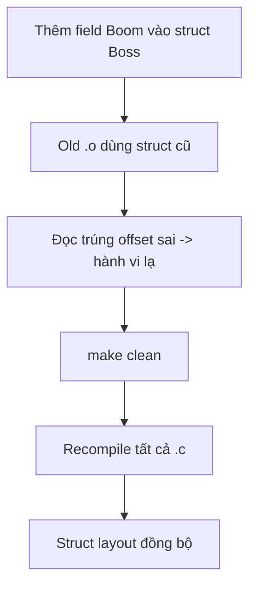


---

## 19. Build, Rebuild Và Chạy Game

### 19.1. Build (root Makefile → `theforest.exe`)

Build chính nằm ở **root**, link cả `boss/src/*.o` (gồm `boom.c`):

```bash
mingw32-make
```

Link mẫu (rút từ output thực tế):

```text
gcc src/main.o src/game.o src/camera.o src/map.o \
    boss/src/boss.o boss/src/boss_player.o boss/src/projectile.o \
    boss/src/orb.o boss/src/boom.o src/collision.o src/gamestate.o \
    -o theforest.exe -Lraylib/lib -lraylib -lopengl32 -lgdi32 -lwinmm
```

### 19.2. Rebuild khi đổi struct/header (bắt buộc)

```bash
mingw32-make clean
mingw32-make
```

> Thêm field vào `Boss` (như Boom fields) **bắt buộc** rebuild hết, nếu không lệch struct layout.

### 19.3. Chạy

```bash
theforest.exe
```

> Game vào map 3 mới là boss fight. Chạy từ root để path `boss/assets/...` đúng.

### 19.4. Quy trình kill + rebuild nhanh (Windows)

```powershell
taskkill /IM theforest.exe /F 2>$null; mingw32-make
```

---

## 20. Đính Chính So Với Báo Cáo Cũ

| Mục | Bản cũ | Bản mới (thực tế) |
| --- | --- | --- |
| Cốt lõi đánh boss | Đánh trừ máu trực tiếp + statue | **Boom Node**: phá 3 cục boom/phase bằng orb parry |
| Boss states | 6 state | **8 state** (thêm `FAKE_DEATH`, `TRUE_ENRAGE`) |
| Phase progression | Theo % máu | Theo **số boom đã phá** (đủ 3 → -25% máu → phase kế) |
| Boss attack tự động | Đang chạy (laser/slam/claw...) | **Bật lại từ Phase 2** (`phase >= BOSS_PHASE_2`); Phase 1 chỉ có boom đạn đỏ |
| Đạn đỏ boom | Cả 3 cục bắn ring | Phase >=2: chỉ GIỮA bắn ring; TRÁI=laser beam, PHẢI=shockwave pulse |
| Orb vàng vào phase mới | Có thể spawn tức thì | Có delay ngắn 4–7s (reset stagger khi chuyển phase) |
| Cửa thoát (tích hợp) | Cửa vòm giả x≈1190, trigger x≥1150 | Cửa gỗ thật `doorX=1080`, trigger `x>=1060` (đồng bộ 2 bản) |
| Camera shake | Random mỗi frame (giật lag) | Sin theo thời gian + decay + clamp (mượt) |
| Statue | Gameplay đánh tượng | **Tắt**, chỉ trang trí tĩnh |
| Orb | Boss nhả → player bắt → bay về | Orb vàng **rơi xuống đất** → player **lụm** → bay lên **phá boom** (30–45s/lần) |
| Nguồn hại player | Các chiêu boss | **Ring damage-orb** từ cục boom (có khe né) |
| Kết trận | DYING → DEFEATED | FAKE_DEATH → cửa thoát → REVIVAL → TRUE_ENRAGE → DYING |
| BOSS_MAX_HP | 120 | **75** |
| Animation chết | 30 đốm random rối | Chìm + nghiêng + 3 vòng đều + 3 cụm explosion |
| Timer "05:00" | Hiển thị | Nên **bỏ** (atom bomb đã không còn là cơ chế chính) |
| Build output | `bossfight.exe` (boss/Makefile) | `theforest.exe` (root Makefile, gồm `boom.c`) |
| Đi-bộ-only | Chỉ pre-intro | Pre-intro **và** đi ra cửa (cấm nhảy + đánh) |
| Camera | zoom ~1.13 | zoom out **~0.95** |

---

## 21. Checklist Hoàn Thành

- [x] Mô tả hệ Boom Node (spawn/update/draw, ring orb, vị trí 3 cục theo phase).
- [x] Mô tả cơ chế orb parry phá boom (rơi → lụm → bay lên).
- [x] Mô tả chuỗi giả chết → đi ra cửa → hồi sinh → TRUE_ENRAGE.
- [x] Mô tả animation chết làm lại (gọn, điện ảnh).
- [x] Ghi rõ hệ attack cũ + statue đã tắt.
- [x] Cập nhật state machine 8 state + `BOSS_MAX_HP = 75`.
- [x] Cập nhật đi-bộ-only (cấm nhảy/đánh) + camera zoom out.
- [x] Cập nhật build/rebuild/run đúng `theforest.exe` + `boom.c`.
- [x] Bảng đính chính so với báo cáo cũ.
- [x] **Fix camera shake giật lag** (sin theo thời gian + clamp).
- [x] **Bật lại attack tự động boss từ Phase 2.**
- [x] **Chia vai 3 cục boom Phase >=2** (giữa=ring, trái=laser, phải=shockwave).
- [x] **Orb vàng có delay 4–7s khi vào phase mới** (không spawn tức thì).
- [x] **Đồng bộ cửa thoát** `doorX=1080` / trigger `x>=1060` cả 2 bản.
- [x] **Standalone giữ HUD + update projectile/orb ở TRUE_ENRAGE** (rebuild `bossfight.exe`).

### Việc còn nên làm (đề xuất)

- [ ] Phase 1: ring orb bắn **đơn giản từng cái một**, tăng dần độ khó theo phase.
- [ ] Add asset `effects/vfx/orbdamage/sprite-sheet.png` cho ring orb (thay vòng tròn hồng tạm).
- [ ] Xóa block vẽ timer "05:00".
- [ ] Thêm sprite/texture riêng cho laser beam + shockwave của cục boom (hiện vẽ bằng `DrawLineEx`/`DrawCircleLines`).

---

## 22. Kết Luận

Bản cập nhật này biến boss fight từ "chém cho hết máu" thành **giải đố hành động + tường thuật**:

1. **Boom Node** là cốt lõi: phá 3 cục boom mỗi phase bằng orb parry, né ring orb để sống.
2. **Cú lừa giả chết**: player tưởng thắng, đi ra cửa, boss bất ngờ hồi sinh — tạo cao trào.
3. **TRUE_ENRAGE**: màn kết liễu rõ ràng (1 HP, parry trúng là thắng).
4. **Animation chết** gọn, điện ảnh thay cho hiệu ứng random rối mắt.
5. **Đi-bộ-only + camera zoom out** giữ nhịp cutscene và cho thấy toàn cảnh sân đấu.

> Báo cáo đã đối chiếu trực tiếp với `boss/src/boom.c`, `boss/src/boss.c|h`, `boss/src/boss_player.c` và `src/main.c` ở trạng thái build `theforest.exe` hiện tại.

---

## Footnotes

[^1]: Nếu export PDF lỗi font tiếng Việt, bật CJK/International font support trong MD2FILE hoặc chọn template có font Unicode tốt.

[^2]: Statue gameplay vẫn còn trong source nhưng bị tắt (chỉ trang trí). Hệ attack tự động của boss đã **bật lại từ Phase 2**; muốn boss "im" trở lại thì đổi điều kiện `boss->phase >= BOSS_PHASE_2` về `false` trong `UpdateBoss`.
